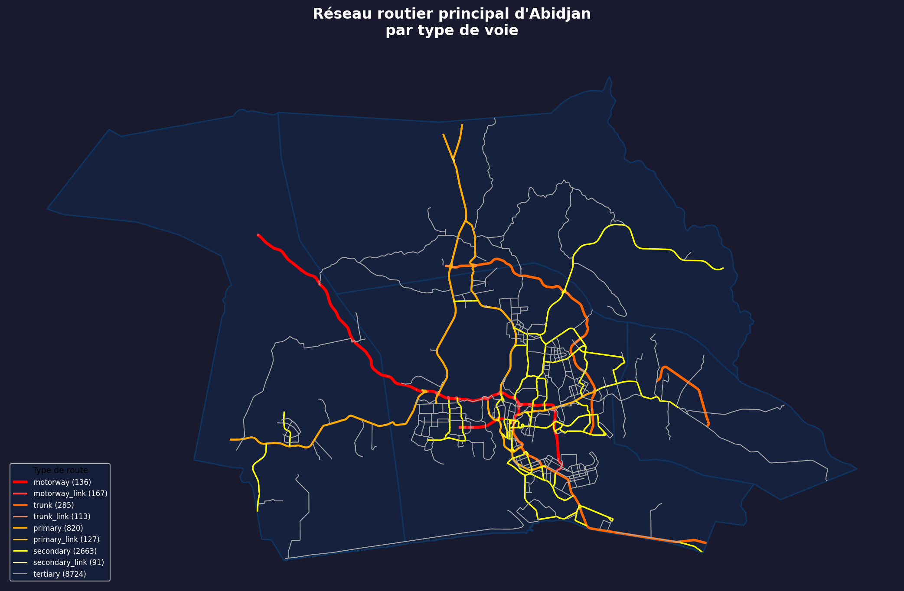
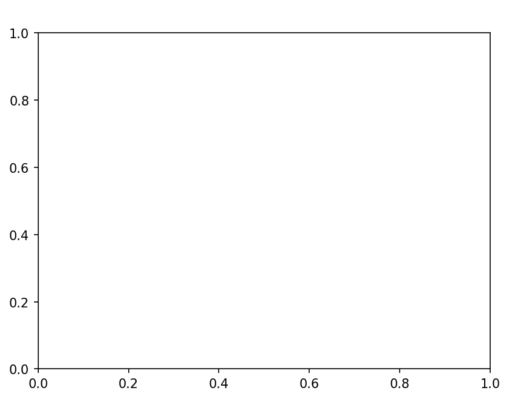
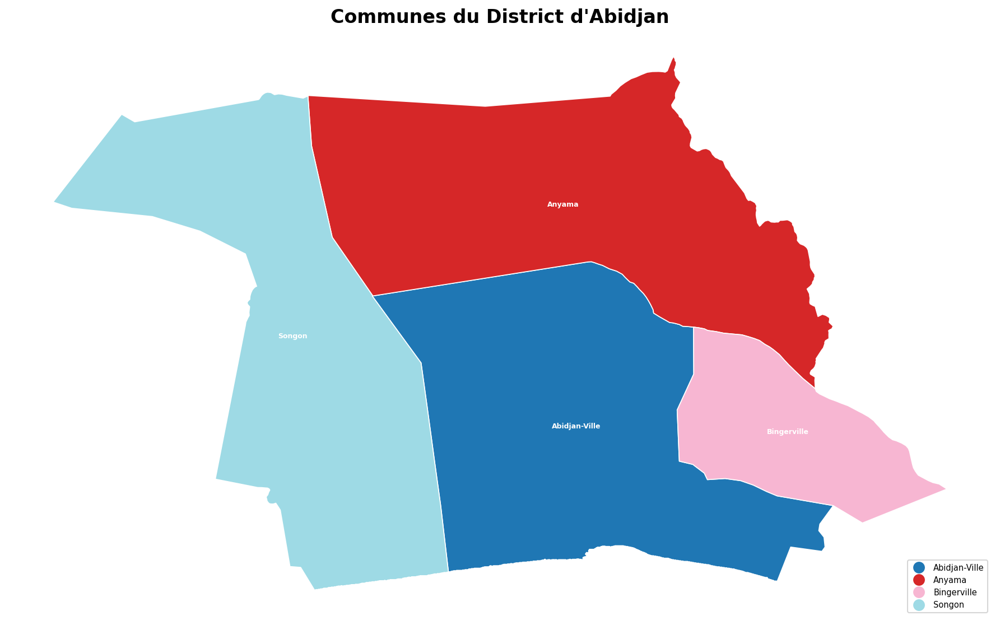
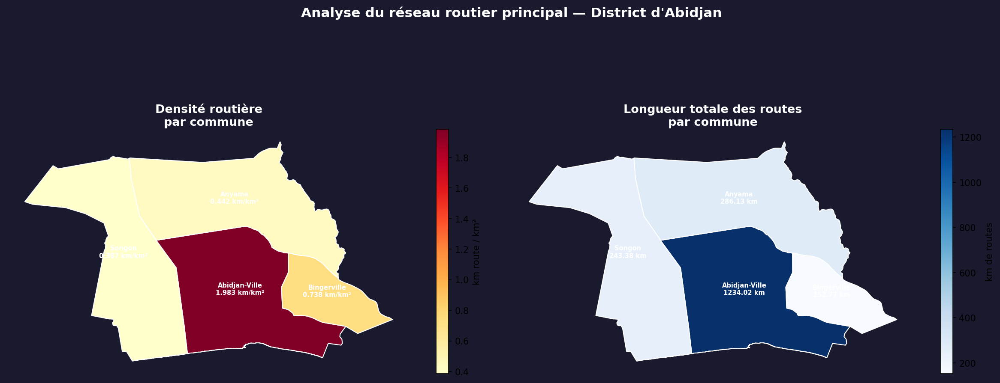

# Abidjan Traffic  Analyse des Zones de Congestion Critiques

> Cartographie spatiale et analyse du réseau routier du District d'Abidjan à partir de données ouvertes.



---
## Lien de la carte: https://kodjo-valentin.github.io/-abidjan-traffic/
##  ontexte et problématique

Abidjan, capitale économique de la Côte d'Ivoire et l'une des métropoles les plus dynamiques d'Afrique de l'Ouest, est confrontée à un défi urbain majeur : **la congestion routière**.

Avec plus de **5 millions d'habitants** dans le District et une croissance urbaine rapide, les embouteillages affectent quotidiennement des centaines de milliers de personnes. Les axes reliant Yopougon au Plateau, les échangeurs d'Adjamé, ou encore les corridors vers Cocody et Marcory sont des points de saturation chroniques — pourtant peu documentés avec des outils de data science.

### Questions auxquelles ce projet répond

- Quelles sont les communes du District d'Abidjan les plus denses en infrastructure routière ?
- Quels types de voies concentrent le plus de flux potentiel ?
- Comment visualiser le réseau routier de manière claire, interactive et accessible ?

---

## Objectifs du projet

1. **Extraire** et structurer le réseau routier d'Abidjan depuis des sources ouvertes
2. **Analyser** la densité routière par commune (km de route / km²)
3. **Identifier** les axes critiques par hiérarchie de voies
4. **Visualiser** les résultats via une carte interactive futuriste publiée sur le web

---

## Données collectées

| Source | Données | Format | Lien |
|--------|---------|--------|------|
| **OpenStreetMap via OSMnx** | Réseau routier complet d'Abidjan (145 963 segments) | GeoPackage / GeoJSON | [openstreetmap.org](https://www.openstreetmap.org) |
| **Geofabrik** | Shapefile Côte d'Ivoire (routes, POI, bâtiments) | `.shp` | [geofabrik.de](https://download.geofabrik.de/africa/ivory-coast.html) |
| **WorldPop** | Densité de population — Côte d'Ivoire 2020 (résolution 100m) | GeoTIFF `.tif` | [worldpop.org](https://hub.worldpop.org/geodata/listing?id=29) |
| **GADM** | Limites administratives — Côte d'Ivoire (niveaux 1 à 4) | `.shp` | [gadm.org](https://gadm.org/download_country.html) |

### Détail du réseau routier analysé

| Type de voie | Nombre de segments | Rôle |
|---|---|---|
| `residential` | 128 611 | Rues de quartier |
| `tertiary` | 8 732 | Routes secondaires locales |
| `secondary` | 2 663 | Axes intermédiaires |
| `primary` | 820 | **Axes principaux** |
| `trunk` | 285 | **Voies rapides** |
| `motorway` | 136 | **Autoroutes** |

---

## Méthodologie

```
Données OSM          Données Admin         WorldPop
     │                    │                   │
     ▼                    ▼                   ▼
Extraction OSMnx    Filtrage Abidjan    Raster population
     │                    │
     └────────────────────┘
              │
       Jointure spatiale
       (gpd.clip / PostGIS)
              │
     ┌────────┴────────┐
     ▼                 ▼
Densité routière   Hiérarchie des voies
 par commune         (motorway → tertiary)
     │                 │
     └────────┬────────┘
              ▼
     Visualisation finale
     (Matplotlib + HTML/JS)
```

### Indicateur clé Densité routière

```
Densité (km/km²) = Longueur totale des routes (km)
                   ─────────────────────────────────
                        Superficie de la commune (km²)
```

---

## Résultats principaux

### Densité routière par commune

| Commune | Longueur routes | Superficie | Densité routière |
|---------|----------------|------------|-----------------|
| **Abidjan-Ville** | 1 234 km | 622 km² | **1.983 km/km²** 🔴 |
| Bingerville | 153 km | 207 km² | 0.738 km/km² 🟠 |
| Anyama | 286 km | 647 km² | 0.442 km/km² 🟡 |
| Songon | 243 km | 630 km² | 0.387 km/km² 🟢 |

> **Abidjan-Ville concentre à elle seule plus de 1 234 km de routes principales** sur une superficie de 622 km², soit une densité **4× supérieure** aux autres communes — ce qui explique structurellement la saturation chronique de ses axes.

---

## Livrables visuels

### 1. Réseau routier complet


### 2. Communes du District


### 3. Routes principales par type


### 4. Carte choroplèthe — Densité routière


### 5. Carte interactive (voir démo live)
> **[Ouvrir la carte interactive](https://TON_USERNAME.github.io/abidjan-traffic/)**

---

## Stack technique

| Catégorie | Outils |
|---|---|
| **Extraction réseau** | `osmnx` |
| **Analyse spatiale** | `geopandas`, `shapely`, `rasterio` |
| **Analyse de données** | `pandas`, `numpy` |
| **Visualisation statique** | `matplotlib` |
| **Visualisation interactive** | `Leaflet.js`, `HTML/CSS/JS` |
| **SIG bureau** | QGIS |
| **Environnement** | Python 3, Jupyter Lab |

---

## Structure du projet

```
abidjan-traffic/
├── index.html                        ← Carte interactive (GitHub Pages)
├── README.md
│
├── Notebooks/
│   ├── 01_extraction_reseau.ipynb    ← Extraction OSM + visualisation
│   └── 02_analyse_trafic.ipynb       ← Analyse densité + carte choroplèthe
│
├── data/
│   ├── raw/
│   │   ├── ivory-coast-latest-free.shp/   ← Geofabrik
│   │   ├── civ_ppp_2020.tif               ← WorldPop
│   │   └── admin/                         ← GADM niveaux 1–4
│   └── processed/
│       ├── abidjan_roads.gpkg
│       ├── routes_abidjan.geojson
│       └── communes_abidjan.geojson
│
└── outputs/
    ├── reseau_abidjan.png
    ├── communes_abidjan.png
    ├── routes_principales_abidjan.png
    └── densite_routiere_abidjan.png
```

---

## Reproduire le projet

```bash
# 1. Cloner le dépôt
git clone https://github.com/TON_USERNAME/abidjan-traffic.git
cd abidjan-traffic

# 2. Installer les dépendances
pip install osmnx geopandas matplotlib folium shapely rasterio pandas numpy

# 3. Lancer Jupyter
jupyter lab

# 4. Exécuter les notebooks dans l'ordre
#    01_extraction_reseau.ipynb
#    02_analyse_trafic.ipynb

# 5. Visualiser la carte interactive
python -m http.server 8080
# → http://localhost:8080/index.html
```

---

## Auteur

**KODJO Kablan Valentin Martial**
Étudiant en Licence Professionnelle de Géomatique et Stratégies Spatiales
Université Félix Houphouët-Boigny (UFHB), Abidjan

[](https://www.linkedin.com/in/kablan-valentin-martial-kodjo154993311/)
[](https://kodjo-valentin.github.io/Bornes-VE-CI/)

---

## Licence

Données : [© OpenStreetMap contributors](https://www.openstreetmap.org/copyright) — ODbL
Population : [WorldPop](https://www.worldpop.org) — CC BY 4.0
Code : MIT License
